# Top 25 Best Multi-Modal Transportation Booking Platforms in 2025

Planning trips across Europe or Asia means juggling dozens of train operators, bus companies, ferry schedules, and flight options. The right multi-modal transportation platform consolidates price comparisons, schedules, and instant booking into one search, cutting research time from hours to minutes. This curated overview covers 25 platforms ranked by route coverage, booking reliability, and real-world usability, helping you compare buses, trains, flights, and ferries without switching between countless operator websites.

---

## **[Omio](https://www.omio.com)**

Leading European transportation aggregator comparing trains, buses, flights, and ferries across 800+ operators for seamless multi-destination journeys.

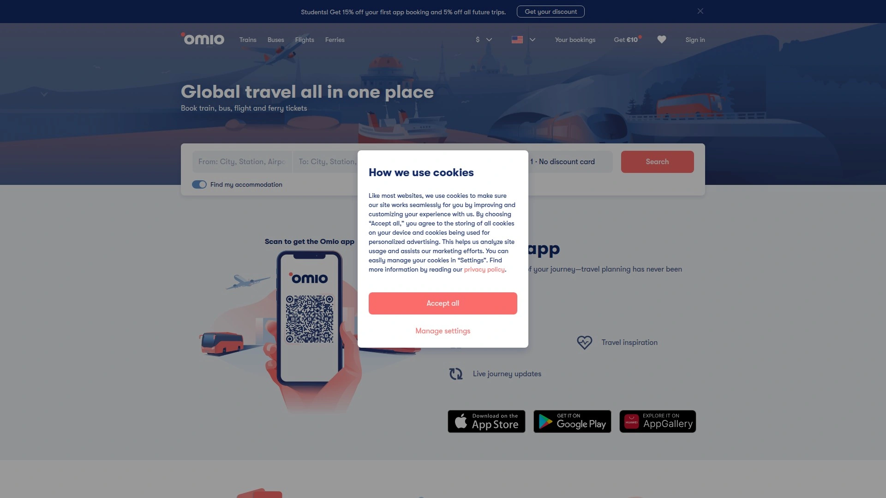

Founded in Berlin in 2013 as GoEuro, Omio transformed how travelers navigate European transport networks. The platform covers 35+ countries spanning Europe, the U.S., and Canada, integrating schedules from major operators like Eurostar, SNCF, Deutsche Bahn, FlixBus, and Ryanair into unified search results. Enter departure and arrival cities, and Omio generates comprehensive comparisons sorted by price, duration, or transport mode. Digital ticketing eliminates printed confirmations for most routes, storing e-tickets in the mobile app. Multi-currency support and automatic language detection serve international travelers seamlessly. The interface emphasizes speed, displaying real-time pricing updates and remaining seat availability. Mobile apps for iOS and Android mirror web functionality with push notifications for schedule changes. Booking typically incurs small service fees, though transparency varies by route. Customer service directs most issues to transport operators themselves, limiting Omio's intervention capabilities. The platform shines for complex itineraries requiring multiple transport types, like combining trains from Paris to Turin with buses to Florence. Real-time updates and instant mobile tickets make last-minute bookings practical.

***

## **[Rome2Rio](https://www.rome2rio.com)**

Comprehensive trip planner mapping every transportation option between global destinations with price estimates and detailed route breakdowns.

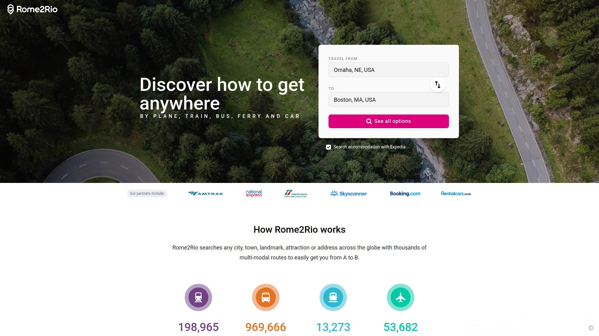

Rome2Rio functions as the ultimate research tool, displaying every conceivable way to travel between two points worldwide. The platform covers 240+ countries including major operators like Amtrak, VIA Rail, Eurostar, Renfe, FlixBus, Greyhound, and most airlines. Search results show trains, buses, ferries, flights, rideshares, and driving distances with duration estimates and approximate costs. Multi-destination itineraries chain together, like planning Amsterdam to Bern to Sardinia with stops in Pavia. Each leg breaks down into specific operator options with booking links. The trip planner saves complex itineraries for logged-in users, enabling easy sharing with travel companions. Hotel suggestions near destinations integrate through trusted partners. Rome2Rio excels at discovering routes to off-the-grid locations where traditional booking sites fail. The platform doesn't always enable direct booking, instead directing users to operator websites or aggregators like Swiss Railways or ferry companies. Price estimates guide budgeting though actual costs require checking operator sites. Free usage without account requirements removes barriers. Mobile apps for iOS and Android bring planning capabilities anywhere. The visual map interface helps conceptualize complex routes better than text lists.

***

## **[Wanderu](https://www.wanderu.com)**

North American and European bus and train specialist offering lowest-price guarantees with 500+ carrier partnerships.

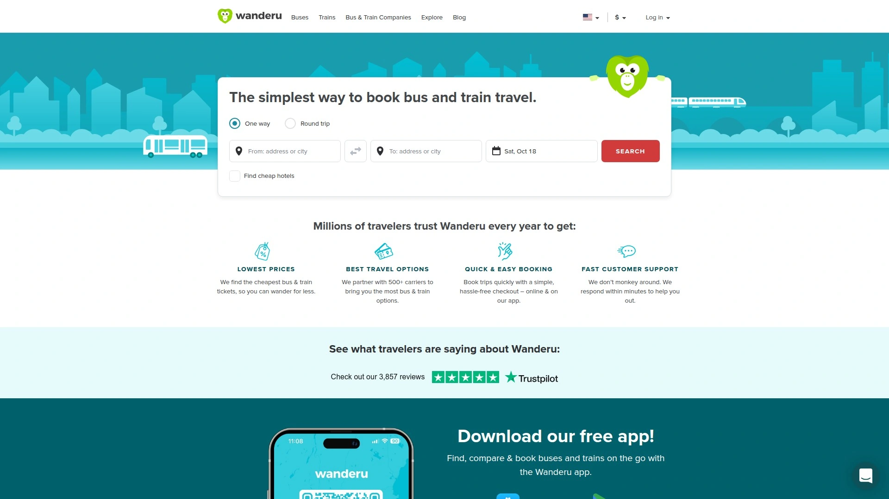

Wanderu simplifies ground transportation across the United States, Canada, and Europe by aggregating schedules and prices from hundreds of bus and train companies. Partners include Greyhound, Amtrak, Megabus, FlixBus, National Express, and regional operators. The search interface filters results by price, departure time, duration, and amenities like WiFi and power outlets. Book directly through Wanderu or redirect to carrier websites depending on the operator. The checkout process streamlines ticket purchase, delivering confirmation emails and e-tickets instantly. Rental car options supplement transit bookings for routes with limited public transport. The platform targets budget-conscious travelers prioritizing cost over luxury. Two-month booking windows align with when bus companies release schedules, limiting advance planning. Station mapping helps identify exact departure and arrival locations beyond just city names. Wanderu positions itself as an official carrier partner rather than third-party reseller, promising direct pricing without markups. Customer service quality varies, with refund policies defaulting to carrier terms. The mission centers on expanding wander-friendly mobility options at accessible price points. Mobile apps enable on-the-go booking with saved payment methods.

***

## **[Trainline](https://www.thetrainline.com)**

Europe's leading independent train retailer selling tickets for 35 countries with no hidden fees or booking charges.

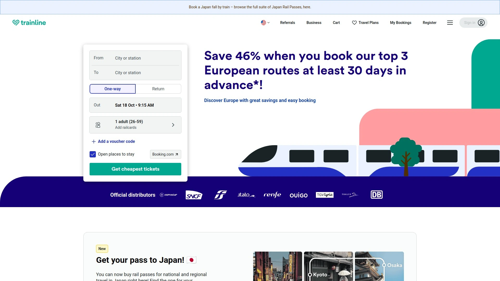

Trainline connects to French, German, Spanish, Swiss, Italian, Austrian, Benelux, and Westbahn ticketing systems, covering major European rail networks. The platform handles complex multi-operator journeys like Paris to Florence requiring French high-speed trains to Turin then Trenitalia services onward. Neither individual railway websites nor most competitors sell such combined tickets seamlessly. Plain English interface accepts multiple currencies with overseas credit cards causing no payment issues. Digital ticketing provides e-tickets or ticketless travel using confirmation codes. The 58-second average booking time reflects interface simplicity. Trainline automatically compares prices across different ticket types and operators, finding optimal combinations. Official pricing matches operator direct sales with zero booking fees added, contradicting many aggregator models. Bus tickets supplement train options for complete ground transport coverage. The platform sells French budget Ouigo trains absent from some competitors. Mobile apps mirror web functionality with ticket storage and real-time updates. Founded as the UK's original online rail retailer, Trainline expanded into pan-European services competing with Rail Europe. Marginally better connectivity than alternatives, though Scandinavian, Eastern European, and Iberian coverage remains incomplete. Print-at-station and home printing accommodate various traveler preferences.

***

## **[Busbud](https://www.busbud.com)**

Global bus booking platform covering 80+ countries with 2+ million routes connecting 21,000 cities worldwide.

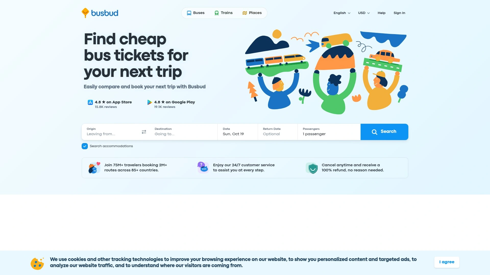

Founded in 2011 after its creator struggled booking South American buses, Busbud digitizes intercity bus networks globally. Partners include Greyhound, BoltBus, FlixBus, National Express, Megabus, and hundreds of regional carriers. The platform supports multiple currencies and languages, removing barriers foreign travelers face with local booking systems. Search results compare fares, amenities, and departure times across operators. Some bookings complete directly through Busbud while others redirect to carrier websites. Mobile apps for iOS and Android enable booking anywhere. Coverage spans North America, South America, Europe, Africa, and Southeast Asia with continuous expansion. The interface emphasizes convenience for backpackers and budget travelers prioritizing cost over comfort. Payment options accommodate international credit cards, PayPal, and regional methods. E-tickets download immediately or arrive via email depending on the carrier. Customer service quality varies, with complex issues often requiring direct carrier contact. Busbud monetizes through booking fees or partnerships rather than ticket markups. The platform particularly helps travelers in countries with limited English-language booking infrastructure. Reviews suggest reliability concerns on specific routes, particularly regarding refunds and schedule changes. The broad coverage makes discovering obscure routes practical.

***

## **[12Go](https://12go.asia)**

Southeast Asia's premier multi-modal booking system covering buses, trains, ferries, flights, and transfers across 10+ countries.

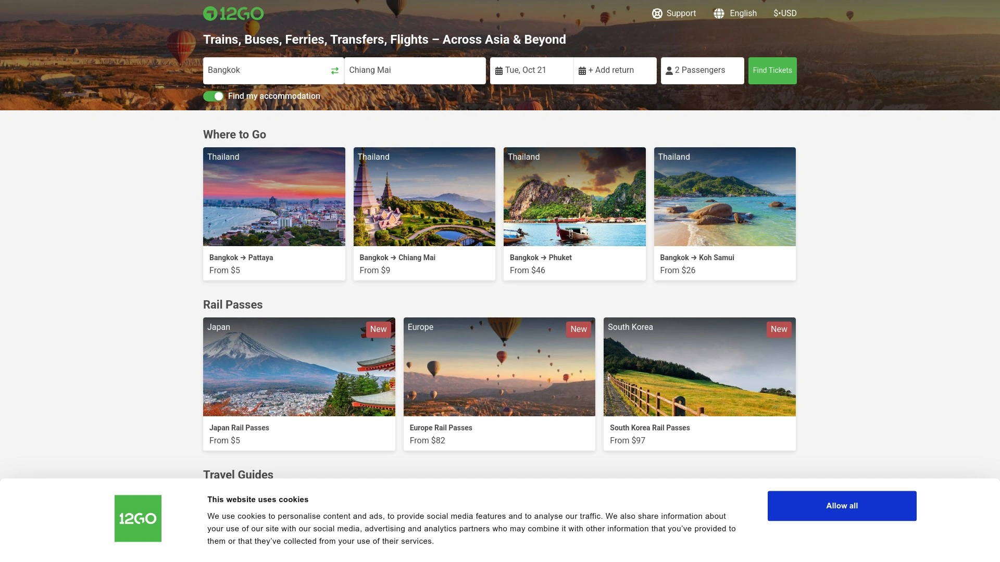

Incorporated in Singapore with Bangkok operational headquarters, 12Go specializes in ASEAN region transportation. The platform operates in Thailand, India, China, Cambodia, Vietnam, Laos, Myanmar, Malaysia, Singapore, Philippines, with Japan, Korea, and Indonesia launching soon. Services include buses, ferries, trains, minivans, private transfers, and flights through a unified booking interface. The ultimate mission connects door-to-door travel across ASEAN under single-standard tickets. Over 500 transport operators and airlines integrate into the system. B2B solutions enable travel agencies and hotels to access the inventory. Payment gateways support multiple currencies and methods for international customers. The platform targets both leisure and business travelers needing convenient e-ticket access. Mobile apps bring full functionality to smartphones for booking on the move. Real-time availability and pricing updates prevent overbooking issues. Customer reviews average positively though some report communication challenges during disruptions. The strategy emphasizes bringing providers together rather than competing, creating comprehensive regional coverage. 12Go Transport Co., Ltd. operates branded vehicles in Thailand, diversifying beyond pure aggregation. The focus on Asian destinations differentiates from Europe-centric competitors. Island hopping and cross-border journeys particularly benefit from integrated ferry, bus, and transfer options.

***

## **[Bookaway](https://www.bookaway.com)**

Simplified ground transportation aggregator connecting travelers with 1000+ operators across Europe, Asia, and South America.

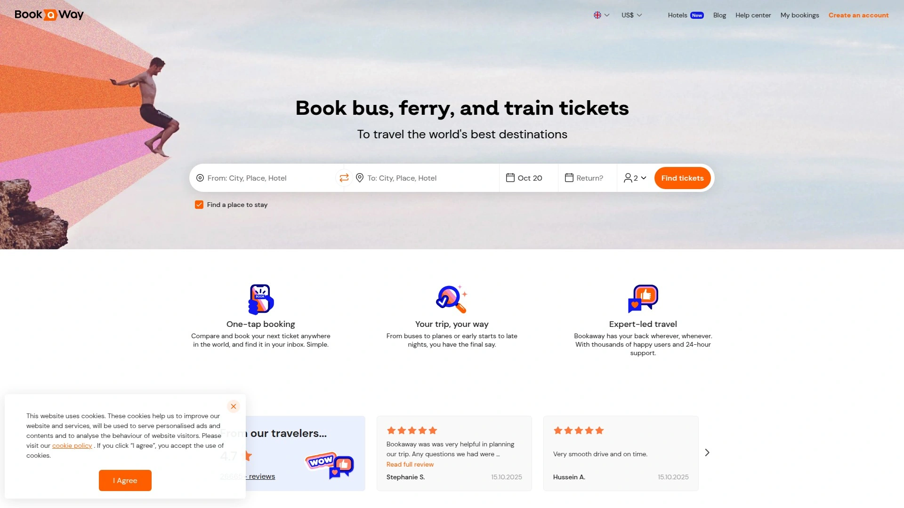

Bookaway streamlines bus, train, ferry, minivan, and private transfer bookings through automated systems. The platform covers Mexico, Costa Rica, Thailand, Croatia, Turkey, Colombia, Vietnam, Brazil, Malaysia, Indonesia, Philippines, Peru, Argentina, Australia, Egypt, Morocco, and dozens more countries. One-tap booking delivers tickets directly to email inboxes without complicated workflows. Search filters accommodate schedule flexibility, allowing travelers to select preferred departure windows and transport modes. Expert-led support operates 24 hours addressing questions and issues. The company positions itself as intermediary connecting travelers with local transport operators rather than controlling services directly. Real-time operator updates feed into availability and confirmation systems. Coverage particularly strong in Latin America and Southeast Asia where booking infrastructure historically lagged. User reviews highlight smooth experiences and responsive support, though some report issues when operators change schedules. Partners include OceanJet, Futa Bus, Mogador, and hundreds of regional companies. The platform targets independent travelers and backpackers navigating multiple countries. Mobile apps for iOS and Android enable booking during travel without laptop access. Digital tickets reduce reliance on printouts at remote bus stations.

***

## **[FlixBus](https://www.flixbus.com)**

Europe's largest low-cost bus network operating 400,000 daily connections to 3,000+ destinations across 35 countries.

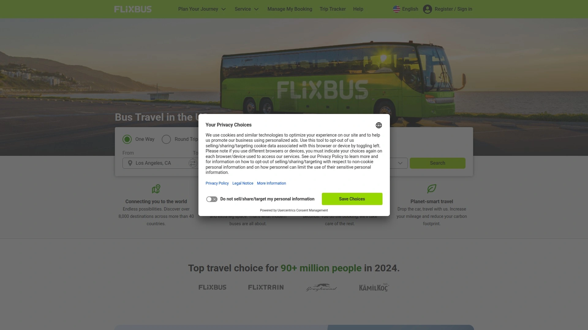

Founded in Germany, FlixBus revolutionized European bus travel through extensive route networks and modern fleet. The distinctive green buses operate throughout France, Netherlands, Switzerland, Germany, Italy, Czech Republic, Hungary, Croatia, Sweden, Denmark, Luxembourg, Slovenia, Austria, and beyond. FlixTrain extends services into German and Swedish rail networks. Popular international routes connect Paris-Berlin from $44 and Prague-Berlin from $20. Onboard amenities include free WiFi, power outlets, toilets, and reclining seats. Mobile tickets eliminate paper confirmations. The platform combines operator and booking service, controlling quality and consistency better than pure aggregators. Direct booking through FlixBus ensures best pricing and seamless customer service. Expansions into the United States, Canada, and Mexico bring the European model globally. Eco-friendly positioning emphasizes bus travel's lower carbon footprint versus flying. The app provides real-time tracking showing bus locations and arrival estimates. Seat selection and extras booking happen during checkout. Frequent travelers benefit from loyalty discounts and special promotions. The network particularly suits backpackers and students prioritizing affordability over speed. Accessibility features accommodate passengers with mobility requirements.

***

## **[Moovit](https://moovit.com)**

World's leading urban mobility app combining public transit, ride-hailing, bikes, and scooters into unified journey planning.

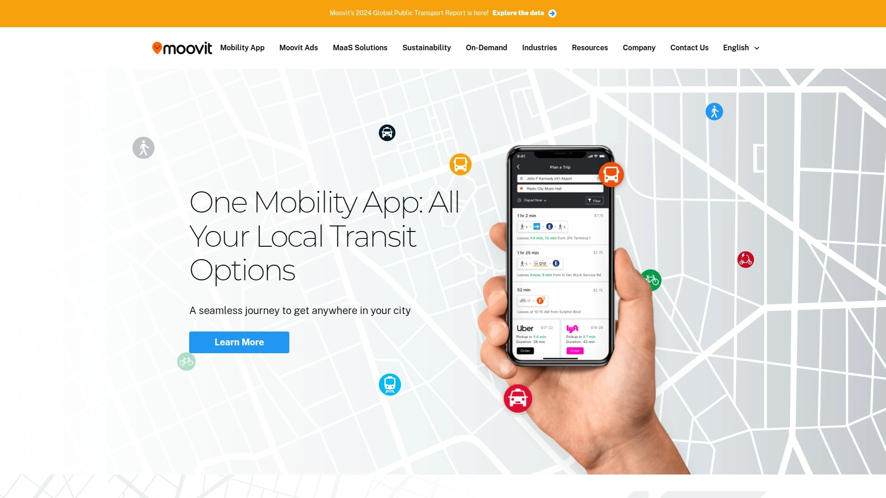

Moovit delivers real-time navigation across buses, trains, subways, ferries, trams, Uber, Lyft, shared bicycles, scooters, and car sharing in 240+ countries. The crowdsourced model integrates official transit data with live user reports, creating accurate arrival predictions. GPS navigation provides step-by-step guidance from origin to destination across multiple transport modes. Users access live maps showing nearby stops based on current location. Augmented reality way-finder helps locate specific bus stops and train platforms. Real-time alerts notify travelers about delays, service changes, and traffic issues. Digital payment integration enables ticket purchase and validation directly through the app in supported cities. Offline maps function underground or without internet connectivity. Community-powered insights include user reports on overcrowding, delays, and station conditions. Personalized favorites quick-access regular routes and stations with change notifications. Bike-friendly route planning integrates cycling with public transit seamlessly. The platform particularly excels at urban navigation where multiple operators and modes create complexity. Intel acquired Moovit in 2020, integrating transportation intelligence into autonomous vehicle development. Transit APIs power public transport features in Uber and Lyft apps. Over 1 billion users worldwide rely on Moovit for daily commuting and exploration.

***

## **[TripGo](https://tripgo.com)**

Award-winning multi-modal app combining any transport mode including train, bus, taxi, ferry, car sharing, bikes, and rideshares.

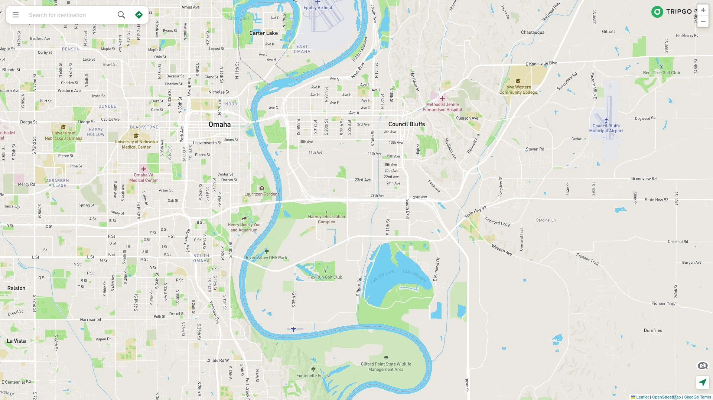

TripGo distinguishes itself by truly mixing and matching all transport types into single journey plans. The platform compares and combines trains, buses, taxis, ferries, trams, personal vehicles, shared cars, bikes, motorcycles, and rideshares. Personalized route preferences account for individual priorities like speed, cost, or comfort. Calendar syncing provides exact departure times ensuring punctuality for appointments. Real-time updates deliver up-to-the-minute predicted arrivals and GPS tracking. Service alerts keep travelers informed about delays and disruptions. The app checks fares, timetables, and directions across all transport modes. Partnership with what3words enables using three-word addresses for precise locations. Users rave about the transformative impact on daily navigation, calling it "a must have app" and "should be 6 stars." The comprehensive approach future-proofs travel planning as cities evolve toward integrated mobility. Navigation guidance includes walking distances and transfer instructions. The platform particularly helps in cities with fragmented transport systems where no single operator dominates. Booking capabilities vary by location and operator. The app serves as universal planner rather than focusing on specific transport types, making it versatile across scenarios.

***

## **[Kombo](https://www.kombo.co)**

European transportation platform aggregating train, bus, and plane tickets with best-price guarantees.

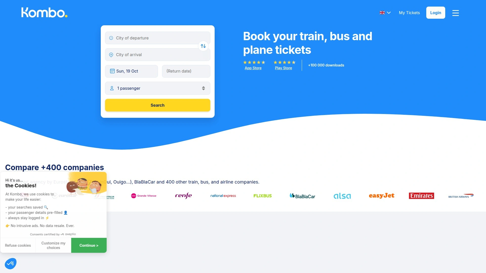

Kombo consolidates European ground and air transportation into streamlined search results. The French platform emphasizes finding optimal combinations of trains, buses, and flights for cost-effective journeys. Search filters accommodate flexible travel dates and times. The interface design prioritizes simplicity, removing overwhelming options that plague some aggregators. Direct booking through Kombo or operator redirection depends on the specific route. The platform targets price-conscious travelers willing to compare multiple options before committing. Coverage focuses on popular European destinations and routes. Mobile-responsive design works across devices without dedicated apps. The best-price positioning appeals to budget travelers and students. Customer reviews highlight reliable booking processes and fair pricing. The company competes directly with established players by emphasizing user experience over feature quantity. Support resources address common booking questions and route planning. The platform demonstrates that market space remains for focused European aggregators alongside global giants. Transparent pricing shows all costs upfront without surprise fees at checkout. The approach resonates with travelers frustrated by hidden charges on other platforms.

***

## **[GetByBus](https://getbybus.com)**

Central European specialist focusing on Balkan routes with extensive coverage across Croatia, Bosnia, and surrounding countries.

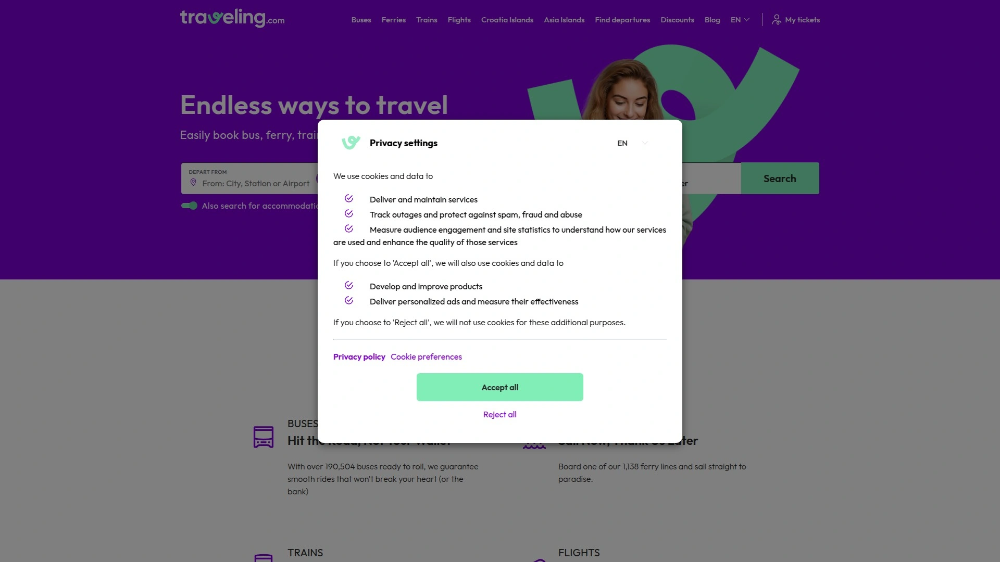

GetByBus emerged from Croatia with deep knowledge of Balkan bus networks often overlooked by major aggregators. The platform covers routes like Skopje-Podgorica-Bar, Zagreb-Sarajevo, and Dubrovnik-Split with real-time schedule updates. Company headquarters in Split provides regional expertise and carrier relationships. Digital ticketing eliminates printing requirements, showing confirmations on phones. Timetables reflect actual schedules rather than outdated information plaguing some competitors. Payment methods include major credit cards and regional options. The platform targets travelers navigating complex Balkan connections where English resources remain limited. User experiences vary, with some reporting smooth bookings and others encountering issues with specific operators. The company actively engages with travelers, responding to concerns on forums and review sites. Coverage extends beyond Balkans into broader European networks. Train routes supplement bus options on select corridors. Baggage fees typically add 1-2 euros for hold luggage. The platform suits budget travelers expecting basic comfort and occasional schedule unpredictability common in the region. Legitimacy concerns appear unfounded, with the Croatian company operating transparently for years. Mobile-optimized site works without dedicated apps.

***

## **[CheckMyBus](https://www.checkmybus.com)**

Bus price comparison engine aggregating schedules from multiple booking platforms and direct operators.

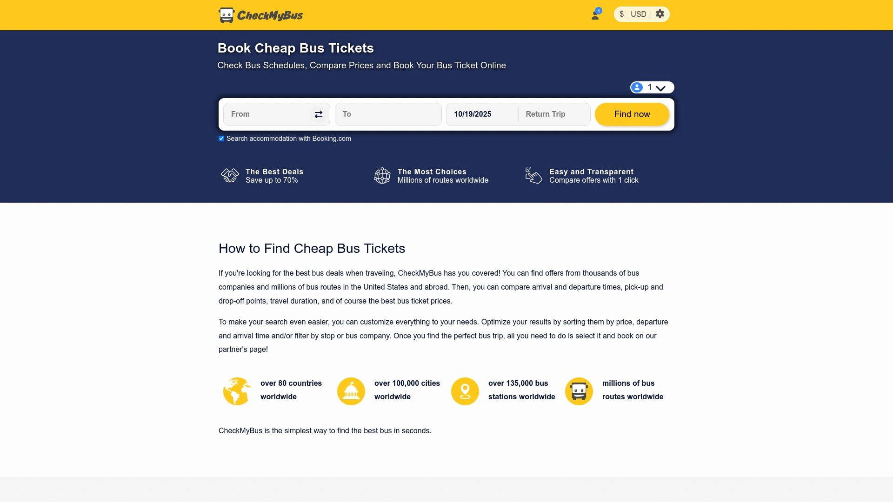

CheckMyBus operates as meta-search comparing results from Omio, Wanderu, Busbud, Bookaway, and direct bus companies. The platform searches hundreds of operators including FlixBus, National Express, BlaBlaCar Bus, Megabus, and regional carriers. Results display by departure time, duration, price, and amenities. Users filter by WiFi availability, power outlets, air conditioning, and direct versus transfer routes. The comparison approach ensures finding lowest prices across booking channels. CheckMyBus doesn't handle bookings directly, redirecting to selected platforms or operators. Travel information covers routes, companies, and booking platform details. The meta-search model suits travelers prioritizing exhaustive price comparison over convenience. Default booking windows suggest three days advance purchase for optimal pricing. Early bookers typically save significantly versus last-minute tickets. Coverage spans Europe, North America, and expanding global routes. The platform particularly helps when single aggregators lack complete operator coverage. Interface simplicity focuses on essential search and comparison functions. No account creation required for searches. The platform demonstrates continuing fragmentation in bus booking markets, necessitating meta-search tools.

***

## **[Kiwi.com](https://www.kiwi.com)**

Innovative travel search engine using virtual interlining to create cheaper flight combinations across unrelated carriers.

Kiwi.com revolutionized flight booking by connecting flights from carriers without codeshare agreements. The virtual interlining combines one-way flights creating cost savings impossible through traditional bookings. Search includes trains and buses alongside flights for true multi-modal options. The algorithm finds creative routing like mixing budget carriers with legacy airlines. Guarantee protections cover missed connections even between unrelated carriers. The platform books each segment separately, managing coordination travelers usually handle manually. Pricing often beats traditional round-trip tickets by identifying asymmetric one-way deals. Nomad and Multicity tools plan complex itineraries visiting multiple destinations. Kiwi.com particularly appeals to flexible travelers prioritizing savings over direct routes. Risk exists when delays cause missed connections between unbundled segments. The guarantee theoretically covers rebooking though some users report claim difficulties. Mobile apps enable booking and itinerary management on the go. Baggage policies vary by carrier segment, requiring attention during booking. The platform suits adventurous travelers comfortable with unconventional routings. Customer service quality appears mixed based on reviews. The innovative approach demonstrates continued evolution in travel booking technology.

***

## **[Kayak](https://www.kayak.com)**

Comprehensive travel metasearch comparing flights, hotels, rental cars, trains, and buses across hundreds of sites.

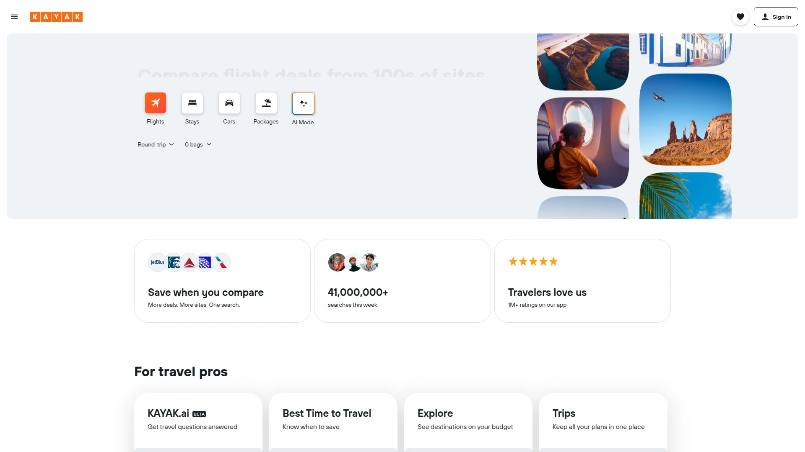

Kayak pioneered travel metasearch before aggregators dominated the space. The platform compares results from airlines, online agencies, hotels, rental companies, and ground transportation operators. Price tracking alerts notify users when monitored trips change in cost. Explore tool generates destination ideas based on budget and dates. Price forecasting predicts whether costs will rise or fall, advising booking timing. Flexible date searches display pricing across multiple departure and return options. Hacker Fares combine one-way flights creating cheaper round-trips than published fares. Trip itinerary management organizes confirmations after booking through partners. The free service monetizes through clicks to booking partners. Multiple travel types within one platform simplify planning complete trips. Mobile apps mirror web functionality with additional mobile-exclusive deals. Filter options accommodate specific preferences including airlines, layovers, departure times, and amenities. The established brand recognition provides trust for new users. Search speed and interface responsiveness exceed many competitors. The platform suits research-focused planners wanting comprehensive options before committing. Kayak competes directly with Google Flights, Skyscanner, and similar metasearch engines in crowded markets.

***

## **[Skyscanner](https://www.skyscanner.com)**

Global travel search engine comparing billions of prices across flights, hotels, and car rentals worldwide.

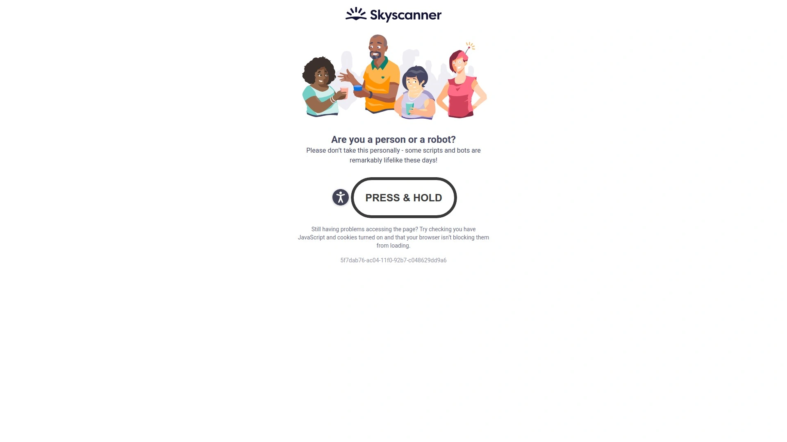

Skyscanner searches over 1,200 airlines and travel providers delivering comprehensive price comparisons. The Everywhere search feature inspires travel by showing cheapest destinations from origin airports. Price alerts track specific routes notifying users of fare drops. Flexible date and month searches identify optimal booking windows. The platform doesn't handle bookings directly, redirecting to airlines or agencies. Transparent pricing shows all fees upfront. Mobile apps bring full search functionality to smartphones with location-based features. Explore mode visualizes destinations on maps with pricing overlays. The freemium model provides full functionality without subscriptions. Skyscanner's Scotland heritage emphasizes European coverage while maintaining global reach. Hotel and car rental comparisons supplement flight search for complete trip planning. The metasearch model ensures finding deals by checking multiple sources simultaneously. User reviews integrate into hotel results providing social proof. Trip planning guides and inspiration content complement search functionality. The platform competes directly with Google Flights and Kayak for market share. Acquisition by China's Trip.com Group provided capital for expansion. Customer service redirects to booking partners since Skyscanner operates as intermediary.

***

## **[Rail Europe](https://www.raileurope.com)**

North American specialist for European train tickets handling complex multi-country rail journeys.

Rail Europe serves travelers planning European rail trips from North America. The platform connects to French, German, Spanish, Swiss, Italian, and Austrian railway systems. Multi-country journeys book as unified tickets rather than separate segments. English interface with dollar pricing removes barriers for American travelers. Phone support provides personalized booking assistance for complex itineraries. Rail passes including Eurail and country-specific options purchase directly through the platform. Seat reservations and sleeper accommodations book simultaneously with tickets. The platform particularly helps navigating Europe's fragmented railway landscape where direct booking proves challenging. Expert knowledge guides travelers toward optimal routes and ticket types. Pricing transparency shows all costs upfront without hidden fees. Physical ticket mailing and e-ticket options accommodate different preferences. The focus on North American customers means understanding payment methods and travel patterns familiar to that market. Competition with Trainline creates options for European rail booking. The platform's longevity demonstrates sustained demand for specialized European rail services. Customer service quality generally exceeds pure aggregators through dedicated rail expertise.

***

## **[Eurostar](https://www.eurostar.com)**

High-speed rail operator connecting London with Paris, Brussels, Amsterdam, and beyond through Channel Tunnel.

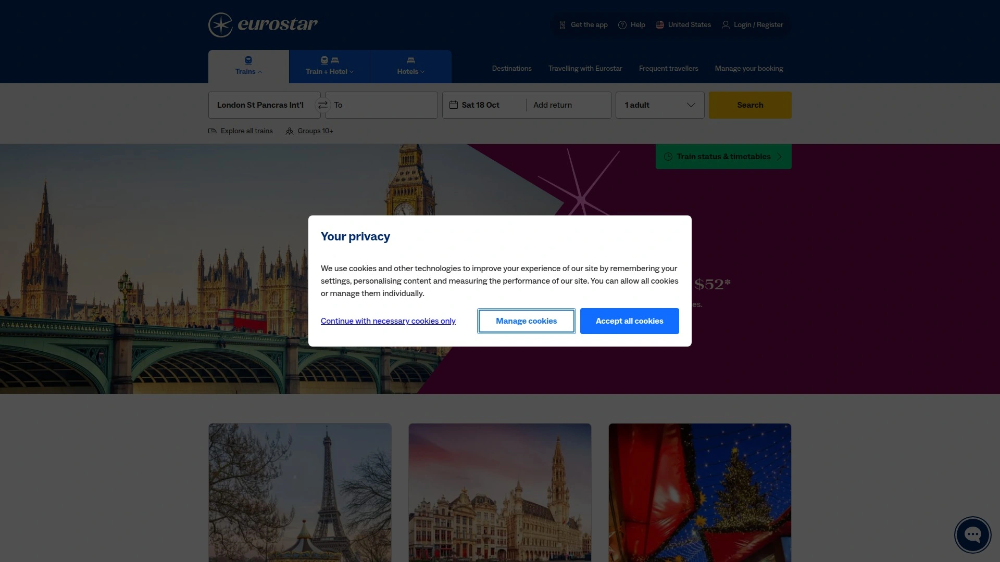

Eurostar operates dedicated high-speed trains through the Channel Tunnel linking Britain with continental Europe. Direct routes connect London St Pancras to Paris Gare du Nord in 2 hours 15 minutes, Brussels in 2 hours, and Amsterdam in 4 hours. Booking direct through Eurostar provides best pricing and flexible ticket options. Onboard services include spacious seating, power outlets, WiFi, bar car, and dining service in Premier. Security screening mirrors airport procedures requiring advance arrival. The trains enable seamless connections between major European cities without flying. Business class and first-class upgrades add comfort for longer journeys. Frequent traveler programs reward regular customers. Baggage allowances accommodate more than budget airlines without extra fees. The dedicated infrastructure means reliability exceeds conventional rail. Environmental benefits position Eurostar as sustainable alternative to short-haul flights. Partnerships with European railways enable onward connections throughout the continent. Booking windows extend months in advance with early-bird pricing. Direct booking eliminates aggregator fees, though sacrificing multi-operator comparison. The iconic brand recognition makes Eurostar synonymous with UK-Europe rail travel.

***

## **[BlaBlaCar](https://www.blablacar.com)**

Ridesharing platform connecting drivers with empty seats to passengers heading the same direction.

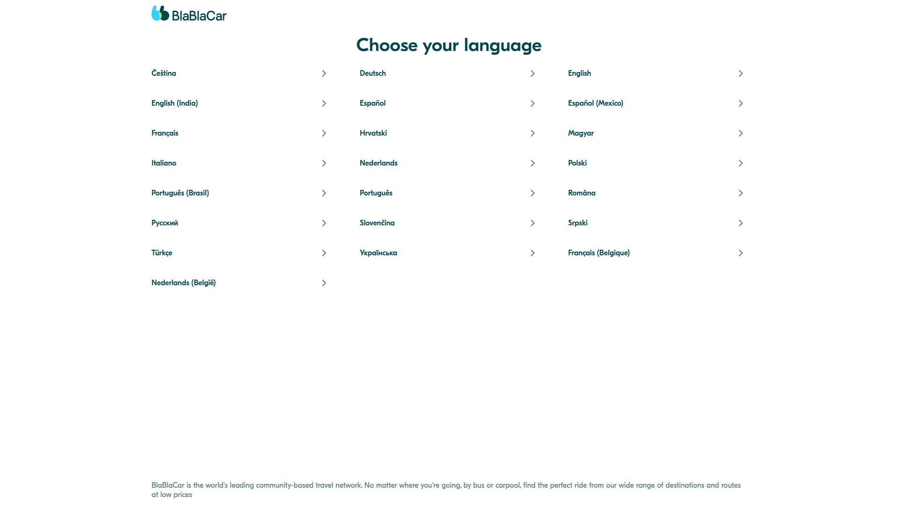

BlaBlaCar pioneered long-distance ridesharing across Europe and beyond. Drivers post upcoming trips with available seats, passengers book and share fuel costs. The platform emphasizes community and social travel over pure transportation. Verification systems including ID checks and member reviews build trust. Pricing typically undercuts buses significantly while offering faster point-to-point travel. The model works particularly well for routes with limited public transport. BlaBlaCar Bus subsidiary operates traditional bus services on popular routes. Environmental benefits from filling empty car seats reduce per-passenger emissions. The platform operates in 22 countries across Europe, Russia, India, Mexico, and Brazil. Mobile apps enable booking and driver-passenger communication. Payment protection holds funds until trip completion. Insurance coverage protects drivers and passengers during journeys. The flexible model accommodates last-minute plans better than scheduled transport. Cultural differences in ridesharing acceptance affect regional adoption. The platform suits adventurous travelers comfortable with informal arrangements. Safety concerns addressed through verification, though risks exceed professional transport operators. The community aspect attracts travelers seeking cultural exchange beyond just getting from A to B.

***

## **[Citymapper](https://citymapper.com)**

Urban transportation app providing real-time navigation across public transit, bikes, scooters, and rideshares in major cities.

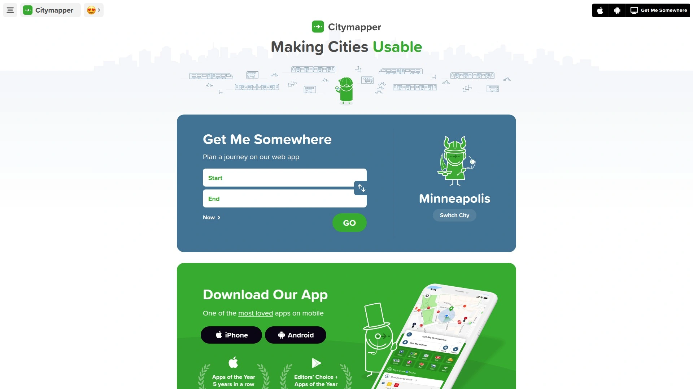

Citymapper specializes in complex urban navigation combining subways, buses, trams, ferries, bikes, and walking. The app provides door-to-door directions with real-time departure updates. Disruption alerts notify users about delays enabling route adjustments. Step-by-step navigation guides travelers through unfamiliar transit systems. The interface design prioritizes clarity, displaying information hierarchically by relevance. Favorite locations and frequent routes quick-access common journeys. The platform integrates rideshare pricing from Uber and Lyft alongside public transit options. Bike-friendly routes account for bike lanes and traffic patterns. Real-time transit tracking shows vehicle locations and predicted arrivals. The app particularly excels in cities with complex multi-operator transit systems. Coverage includes major global cities where transportation complexity justifies specialized apps. Citymapper occasionally operates its own bus services testing innovative routing. Social features enable sharing trip plans with friends. The free model monetizes through partnerships and data services rather than user fees. Offline functionality caches key information when connectivity lapses. The platform demonstrates how urban mobility apps differentiate from general travel booking platforms.

***

## **[Sygic Travel](https://travel.sygic.com)**

Travel planning platform combining itinerary building with offline maps and place recommendations.

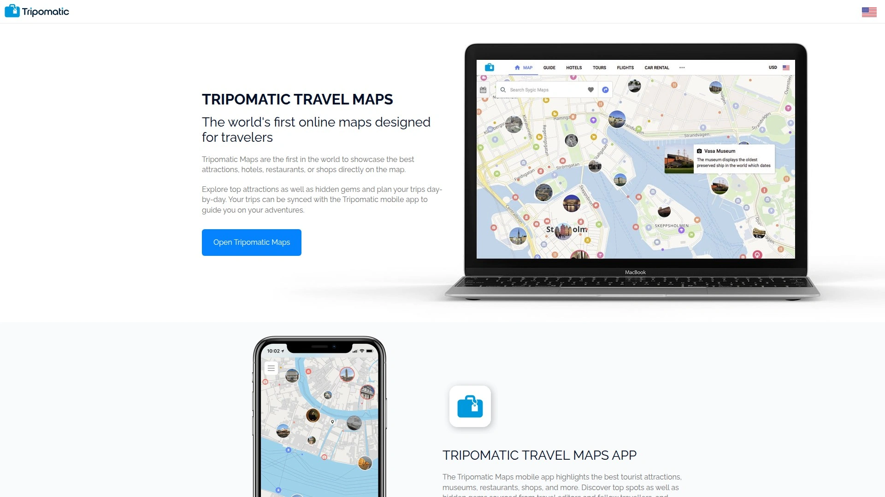

Sygic Travel enables comprehensive trip planning beyond just transportation booking. Users create detailed itineraries adding attractions, restaurants, and accommodations. Offline maps function without data connectivity during travel. Place recommendations draw from traveler reviews and ratings. Day-by-day planning visualizes complete trips with timing and routing. Integration with transportation searches helps book connections between planned stops. The platform emphasizes visual planning with photo-rich content inspiring destinations. Collaboration features enable group travel planning with shared itineraries. Booking widgets connect to partners for accommodations and activities. The comprehensive approach suits travelers wanting unified planning rather than transport-only tools. Mobile apps synchronize with web versions enabling planning across devices. Customization accommodates different travel styles from backpacking to luxury. Travel guides provide context about destinations beyond logistics. The freemium model offers basic planning free with premium features through subscription. GPS navigation during trips provides turn-by-turn directions to planned locations. The platform competes with Google Trips and similar planning-focused tools. Integration depth with transportation booking varies by region and operator.

***

## **[Transit](https://transitapp.com)**

Real-time public transit app covering 200+ cities with GO feature for step-by-step navigation.

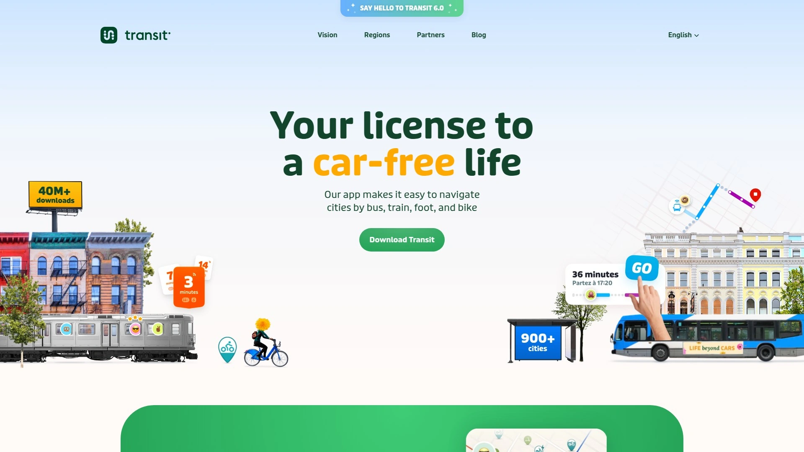

Transit focuses exclusively on urban public transportation with exceptional real-time accuracy. The app displays nearby departures with predicted arrival times. GO navigation provides turn-by-turn directions including where to stand on platforms and which exit to take. Real-time vehicle tracking shows bus and train locations on maps. Disruption alerts notify users about delays and service changes before they impact trips. The minimalist interface removes clutter, prioritizing essential information. Favorite stops and frequent routes feature prominently for regular commuters. Rideshare integration shows Uber and Lyft options alongside public transit. Bike-sharing availability displays docking station status in real time. The platform integrates with Apple Watch and Android Wear for glanceable information. Crowdsourced reports from users enhance accuracy beyond official feeds. The free model sustains through anonymous usage data and partnerships. Transit particularly serves daily commuters needing reliable arrival information. Coverage focuses on North American and European cities with quality transit systems. The company advocates for improved public transportation through data insights. Carbon footprint tracking encourages sustainable travel choices. The platform competes with Moovit and Citymapper for urban transit dominance.

***

## **[Outdoorsy](https://www.outdoorsy.com)**

RV and camper van rental marketplace connecting owners with travelers seeking road trip vehicles.

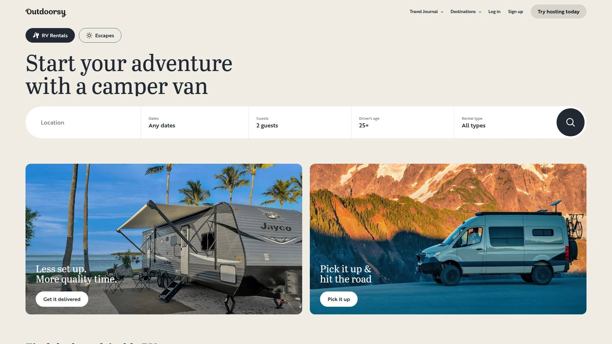

Outdoorsy enables RV rentals from private owners similar to Airbnb for accommodations. Vehicle types span motorhomes, travel trailers, campervans, and truck campers. The platform handles insurance, roadside assistance, and damage protection. Search filters accommodate group size, pet-friendliness, and delivery options. Pricing typically undercuts traditional RV rental agencies. The peer-to-peer model increases vehicle availability in popular destinations. Owner verification and renter reviews build trust in the marketplace. The platform particularly suits national park trips and extended road travel. Delivery services bring vehicles to travelers avoiding depot visits. 24/7 roadside assistance provides security during journeys. Booking flexibility accommodates last-minute plans better than traditional agencies. Insurance tiers protect both owners and renters with customizable coverage. The platform operates in the United States, Canada, Europe, Australia, and New Zealand. Camping gear and equipment rentals supplement vehicle bookings. The growth reflects increasing interest in van life and RV travel. Environmental considerations balance vehicle efficiency against sustainable tourism. The platform competes with RVshare and traditional rental companies like Cruise America.

***

## **[Greyhound](https://www.greyhound.com)**

Iconic North American bus operator serving 2,300+ destinations across U.S., Canada, and Mexico.

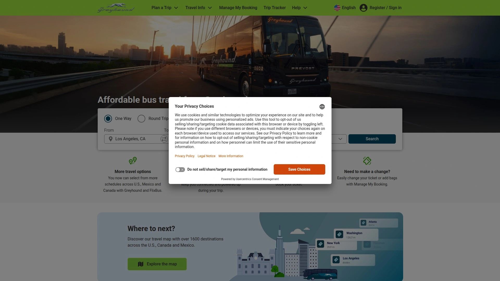

Greyhound represents the original long-distance bus travel in North America, operating since 1914. The extensive route network reaches major cities and small towns alike. Onboard amenities include WiFi, power outlets, and reclining seats. Budget pricing positions Greyhound as accessible long-distance travel option. Direct booking through Greyhound ensures accurate schedules and policies. Frequent traveler rewards provide discounts for regular customers. Station locations span urban terminals to rural stops at convenience stores. The platform targets price-conscious travelers including students and budget tourists. Mobile ticketing eliminates paper confirmations. Baggage allowances accommodate personal belongings without extra fees for standard limits. Transfer connections enable coast-to-coast journeys piecing together routes. The brand recognition makes Greyhound synonymous with American bus travel. Recent years brought fleet modernization and schedule reliability improvements. Partnerships with Mexican carriers extend network beyond borders. Aggregator availability through platforms like Wanderu and Busbud expands discovery. Direct booking sometimes offers promotions unavailable through third parties. Customer service quality varies by station and route, reflecting decentralized operations.

***

## **[National Express](https://www.nationalexpress.com)**

UK's leading coach operator connecting over 900 destinations with reliable scheduled services.

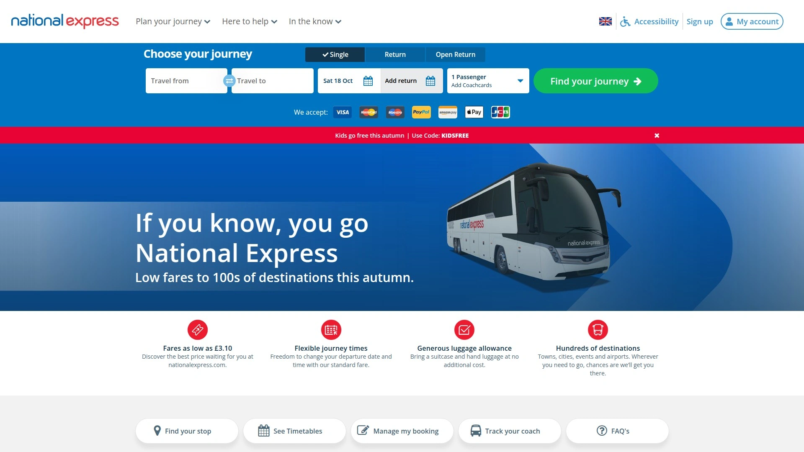

National Express operates comprehensive coach networks throughout the United Kingdom. Routes connect major cities, airports, and smaller towns often underserved by rail. The company emphasizes reliability with scheduled services and guaranteed seats. Onboard amenities include WiFi, power outlets, toilets, and reclining seats. Direct booking provides best fares with advance purchase discounts. Mobile apps enable ticket purchase, storage, and live journey tracking. Funfares offer budget pricing on advance bookings. Airport services connect Heathrow, Gatwick, Stansted, and regional airports with nationwide destinations. Accessible travel accommodations assist passengers with mobility requirements. The platform targets domestic travelers and international visitors exploring Britain. Coach travel competes with trains on price while taking longer than rail. Environmental positioning emphasizes buses' lower emissions versus individual cars. Partnerships with European operators extend network into continental Europe. Customer reviews highlight punctuality and value as key strengths. The established infrastructure and brand recognition provide trust for travelers. Direct booking eliminates aggregator fees while maintaining price competitiveness.

***

## **[Amtrak](https://www.amtrak.com)**

America's national rail operator connecting 500+ destinations across 46 states with long-distance trains.

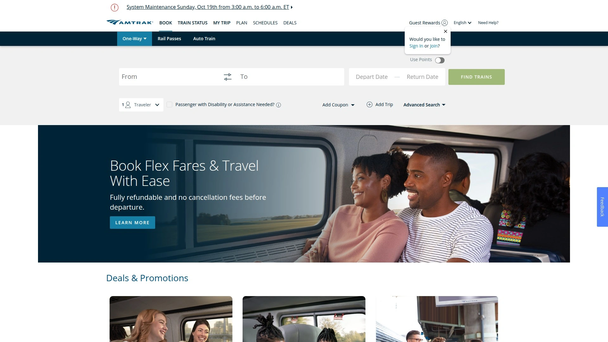

Amtrak provides intercity and long-distance passenger rail service throughout the United States. Routes span short corridors like Northeast Regional to multi-day journeys on California Zephyr and Empire Builder. Onboard amenities include comfortable seating, dining cars, observation lounges, and sleeper accommodations. The extensive network reaches destinations inaccessible by other public transport. Direct booking through Amtrak ensures accurate schedules, policies, and benefits. Rewards programs provide points toward future travel and upgrades. Business class and first-class options add comfort for longer journeys. Station locations enable avoiding airports and traffic congestion. Baggage allowances exceed airlines without extra fees for standard limits. The platform suits travelers preferring scenic routes over speed. Environmental benefits position rail as sustainable alternative to flying or driving. Advance purchase provides significant savings versus walk-up fares. Wi-Fi availability varies by route and train type. The infrastructure challenges limit frequency and reliability compared to European or Asian rail. Partnerships with regional carriers extend network beyond Amtrak operations. Despite limitations, Amtrak represents essential long-distance mobility for many Americans.

***

## FAQ

**How reliable are multi-modal booking platforms compared to booking directly with operators?**

Multi-modal platforms aggregate real-time data from operators but add intermediary layers potentially complicating refunds or schedule changes. Direct operator booking provides clearest customer service channels though sacrifices price comparison convenience. For straightforward routes with single operators, booking direct often proves simplest, while complex multi-country journeys benefit from aggregators like [Omio](https://www.omio.com) handling different systems seamlessly.

**Do booking platforms charge extra fees beyond ticket prices?**

Most aggregators add small service fees covering technology infrastructure and payment processing, typically ranging from a few dollars to 10% of ticket prices depending on the platform and route. [Trainline](https://www.thetrainline.com) notably claims zero booking fees, while others like Omio transparently display service charges before checkout. Always compare total costs including fees rather than just base fares when evaluating platforms.

**Can I get refunds when booking through third-party platforms versus directly with operators?**

Refund policies depend primarily on the transport operator's terms rather than the booking platform. Aggregators typically facilitate refund requests but defer to operator policies, sometimes adding processing delays. Buying travel insurance through platforms or independently protects against non-refundable tickets when plans change unexpectedly, particularly valuable for expensive international bookings.

---

## Conclusion

The right multi-modal transportation platform eliminates hours spent comparing scattered operator websites, consolidating schedules, prices, and booking into unified searches that respect your time and budget. [Omio](https://www.omio.com) stands out for European travelers needing seamless integration across trains, buses, flights, and ferries from 800+ operators, delivering mobile tickets and real-time updates that make complex multi-country journeys manageable. Match your specific needs—regional expertise, global coverage, or urban navigation—to the appropriate platform and reclaim valuable planning time better spent actually traveling.
